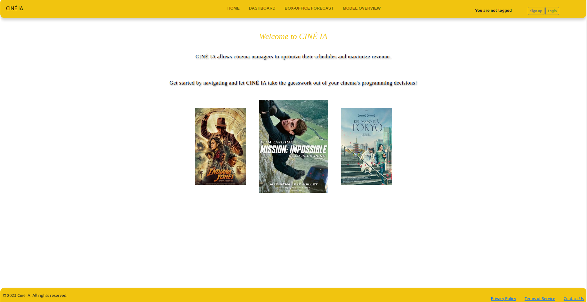

# Prévoir la popularité d'un film
Développer un modèle de machine learning afin d'aider un gérant de salle de cinéma à optimiser sa programmation.

## Contexte du projet
Un gérant de salle de cinéma souhaite développer un outil d'aide à la décision pour définir les films à projeter dans sa salle de cinéma.  Actuellement, il définit la programmation en se tenant au courant des dernières nouveautés, en assistant à des festivals (Cannes, Deauville, etc.). C'est un travail très chronophage. L'outil, qui doit prédire les films qui généreront le plus d'entrées en première semaine, vise à optimiser la programmation et maximiser les revenus. 
Le gérant estime qu'il peut capter environ 1/3000 des spectateurs nationaux. L'objectif principal est de maximiser les revenus, tandis que la diversification des genres et des styles de films est une considération secondaire.

## Arborescence du projet : 
Chaque dossier ci-dessous contient son propre README avec les explications spécifiques.

 - **SCRAP_DATA_FOR_THE_MODEL** : Contient le projet scrapy pour scraper des données sur les films afin de consituer un dataset pour entrainer un modèle de machine learning.

 - **MACHINE_LEARNING** : Etapes de nettoyage des données, d'analyse, de feature engineering et de création du modèle

 - **DJANGO_PROJECT** : Contient les fichiers por l'application web de préduction de popularité des films.  L'application est déployée sur Azure et disponible à l'adresse :
    - **/SCRAP_NEW_DATA** : Contient le project scrapy pour scraper les données sur les films à venir et scraper les boxoffices de la 1ère semaines dès films qui viennent de sortir

- **API** : API déployée sur Azure, exposant le modèle de machine learning, disponible à cette adresse : http://apicinema12.southafricanorth.azurecontainer.io/docs

Un schéma de la BDD ainsi que la maquette figma de l'application web se trouvent également à la racine du projet.

## Executer le projet localement
### 1. Cloner le projet
```
git clone https://github.com/Noura-ou/prevoir_la_popularite_d_un_film.git
```


### 2. Installer les requirements
Les packages requis sont listés dans *requirements.txt*. Pour les installer, il faut exectuer la commande : `pip install requirement.txt`.

### 3. Créer une bdd Azure et s'y connecter depuis le projet 

You must create a new ressource from the Azure Portal and select "SQL Database".  
Executer les fichiers bahs avec les commandes suivantes : 
```
  chmod +x Driver_ODBC_Azure.sh  
  ./Driver_ODBC_Azure.sh  
  chmod +x install_dependencies.sh  
  ./install_dependencies.sh  
```

### 4. Créer un fichier **.env** :   
La clé d'api Scrapeops est obtenue en créant un compte sur https://scrapeops.io/, cet api permet de changer de header à chaque requête pour contourne le blocage des sites.

Les autres paramètres correspondent aux paramètres de la base de donnée SQL Azure.
```
SCRAPEOPS_API_KEY = 'your_api_key'  
DB_USER='username'
DB_PASSWORD='password'
DB_SERVER='server_name'
DB_name='db_name'
DB_Driver='driver'
```

### 5. Créer les tables et insérer les données
Voir le README du dossier **INSERT_DATA_DB_AZURE**.

### 6. Executer l'application django localement

Executer les commandes suivantes :
```
  cd DJANGO_PROJECT
  python manage.py migrate  
  python manage.py runserver  
```
Le projet sera accessible à l'adresse http://localhost:8000/.

## Aperçu de l'application web 




## Documentation utiles

- [Requests Library in Python - Beginner Crash Course](https://www.youtube.com/watch?v=Xi1F2ZMAZ7Q)
- [Site API](https://openweathermap.org/api/hourly-forecast#name5)
- [FastAPI](https://fastapi.tiangolo.com/) 
- [Python](https://docs.python.org/3/)


## Auteurs

- [@noura-ou](https://github.com/Noura-ou)
- [@RolaMmss](https://github.com/RolaMmss)
- [@MyriamLbhn](https://github.com/MyriamLbhn)
- [@namineelbb ](https://github.com/amineelbb)


